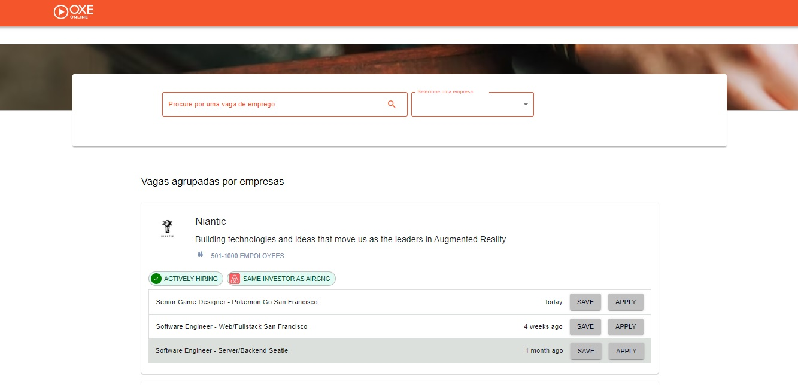
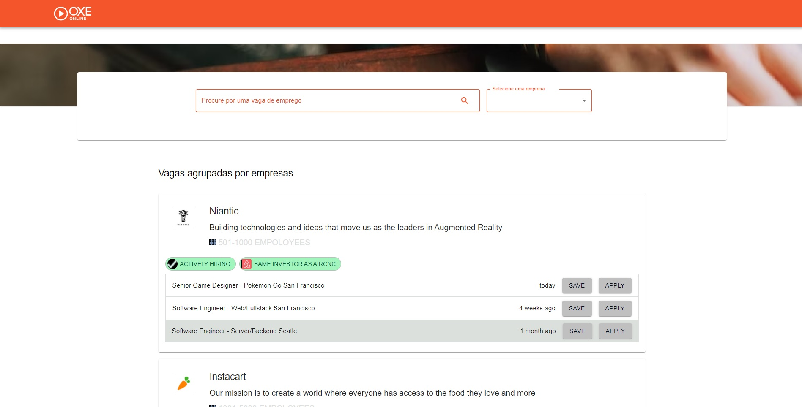
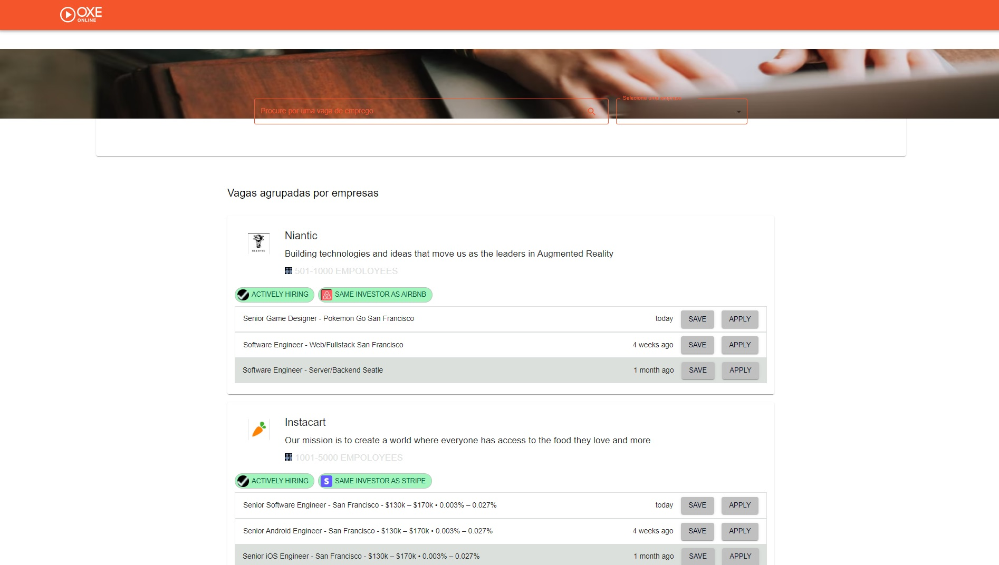
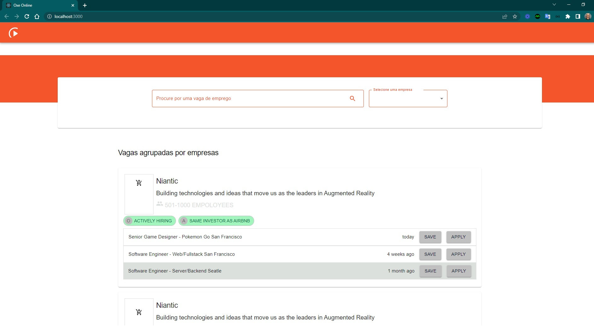
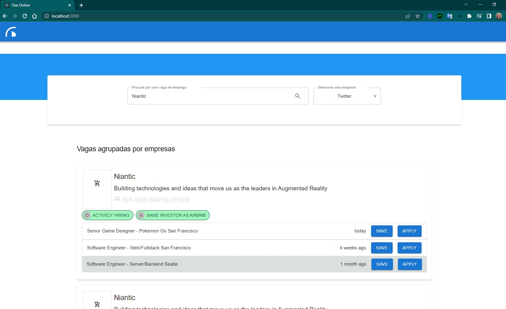

> **Projeto de estudo.** Estado conferido em 31/10/2026: os endereços que seguem fora do ar foram retirados deste README. Detalhes em [docs/AVALIACAO.md](docs/AVALIACAO.md) e próximos passos em [docs/PLANO-ESTRATEGICO.md](docs/PLANO-ESTRATEGICO.md).

<h4 align="center"> 
	🚧 Oxe Online 🚀
</h4>

<p align="center" style="display: flex; align-items: flex-start; justify-content: center;">
  
</p>  

## Estado e próximos passos (ciclo de 03/11/2026)

Projeto de estudo (N1). Finalizado: sim, com a proteção da `main` pendente do responsável (#10).

**O que foi feito**

- Versão 1.0: busca e empresa filtram as vagas, salvar vaga, layout responsivo, axe sem violações (#6, #7)
- Foco visível em duas cores em todas as tabulações, com teste Playwright e axe no CI (#15, fecha #8)
- Caixa "Só salvas" e filtros na URL: o link copiado abre a mesma lista (#15, fecha #9)
- CI também nos PRs para `developer/**`, e Playwright 1.65 para rodar no Ubuntu do CI (#15)

**O que queremos fazer**

- [#10](https://github.com/douglasabnovato/oxe-online/issues/10) Proteger a `main` com PR e CI obrigatórios (responsável)
- [#11](https://github.com/douglasabnovato/oxe-online/issues/11) Publicar no GitHub Pages (responsável). Hoje o endereço responde 404, por isso não há link publicado aqui
- [#12](https://github.com/douglasabnovato/oxe-online/issues/12) Ordenar vagas por data de publicação
- [#13](https://github.com/douglasabnovato/oxe-online/issues/13) Filtro de vagas remotas
- [#14](https://github.com/douglasabnovato/oxe-online/issues/14) ESLint no CI e Dependabot

**Onde está a documentação**

- Estado e critérios: [docs/MVP.md](docs/MVP.md)
- Plano do ciclo, pesquisa e engenharia: [docs/PLANO-DE-ACAO.md](docs/PLANO-DE-ACAO.md#ciclo-de-03112026)

## 🧠 O que aprendi

> Proposta de 01/11/2026, escrita a partir do código e das dependências. Ajuste com a sua experiência.

- Montar interfaces com React, TypeScript e Material UI.
- Estilizar componentes com Emotion.
- Gerar build com verificação de tipos (`tsc --noEmit && vite build`).
- Testar a interface com Vitest.

### Publicação

- Fora do ar desde a conferência de 31/10/2026; para ver o projeto, rode localmente (seção "Como executar").
- Hospedagem prevista: GitHub Pages (gratuito), publicado pelo GitHub Actions a cada push na `main`
- Projeto de estudo: as empresas são reais, mas as vagas são ilustrativas
- Passo a passo: [docs/DEPLOY.md](docs/DEPLOY.md)

### Layout 

Projeto de site conforme o [figma](https://www.figma.com/files/team/1171829626239227287/Jamboo?fuid=850142401757702475).

### Settings 

- [conteúdo de inspiração](https://www.youtube.com/watch?v=wLH1Vv86I44&list=PL29TaWXah3iaqOejItvW--TaFr9NcruyQ)
- ambiente com react + typescript + material-ui
- [React documentation](https://reactjs.org/)
- `npx create-react-app my-app --template typescript`
- `cd my-app`
- `npm start`: Open [http://localhost:3000](http://localhost:3000) to view it in the browser
- `npm install @mui/material @emotion/react @emotion/styled`
- `npm install @mui/material @mui/styled-engine-sc styled-components`
- `npm install @fontsource/roboto`
- `npm install @mui/icons-material`

### Branches

- main, john-backus, brian-kernighan e ken-thompson.

### Docs 

- [customization color](https://mui.com/material-ui/customization/color/)
- [customization theming](https://mui.com/pt/material-ui/customization/theming/)
- [customization button](https://mui.com/pt/material-ui/react-button/)
- [customization adding new colors](https://mui.com/pt/material-ui/customization/palette/#adding-new-colors)
- [customization textfield change label color](https://www.youtube.com/watch?v=Q3z-Qa8uqVU)
- [Design Daily UI](https://uidesigndaily.com/posts/figma-product-info-ui-design-card-day-1575)

### Tarefas 

- [x] inserir elementos
- [x] entendendo customização de componentes material ui com emotion
- [x] inserido os elementos do layout em tela
- [x] inserir ícone de busca no input
- [x] inserir ícone de seleção no input
- [x] personalizar cores da barra de tarefas para laranja
- [x] personalizar cores dos botões para cinza e hover azul
- [x] personalizar textField com bordas laranjas
- [x] personalizar ícones do textField de laranjas
- [x] personalizar imagem do banner com as dimensões corretas
- [x] personalizar ícones da barra de tarefas 
- [x] personalizar logo da empresa como image dos itens listados
- [x] personalizar ícones dos itens listados 
- [x] componentizar
- [x] organizar tarefas no pull request
- [x] posicionar textfield na altura correta  

### Revisões 

- [x] ajustar tamanhos e dimensões dos ícones: investor, icon
- [x] ajustar cor do background do componente Chip
- [x] responsive (v1.0) 

### Componentes 

- [ ] botão design daily usando styled

### Versão 1.0 (revisão de qualidade)

- [x] Busca por texto e seleção de empresa agora filtram as vagas (antes eram só visuais)
- [x] Lista gerada a partir de `src/data/jobs.ts` (antes 3 blocos copiados à mão)
- [x] Salvar vaga (fica guardada no navegador) e "Candidatar-se" abre o site da empresa
- [x] Layout responsivo, textos das ações em português, WCAG AA (axe-core sem violações)
- [x] Vite 8 + MUI 7 + TypeScript 5; testes com Vitest

### Como executar

```bash
npm install
npm run dev     # http://localhost:5173
npm test
npm run build   # build/
npx playwright install chromium   # uma vez
npx playwright test               # foco, axe e filtros no navegador (usa o build)
```

Detalhes em [docs/ANALISE.md](docs/ANALISE.md), [docs/ARQUITETURA.md](docs/ARQUITETURA.md) e [docs/PLANO-DE-ACAO.md](docs/PLANO-DE-ACAO.md).

### Telas 

<p align="center" style="display: flex; align-items: flex-start; justify-content: center;">
  
  
  
  
  
</p>  
