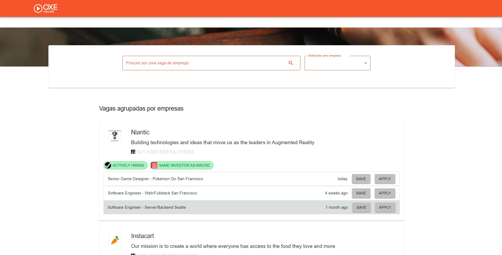

<h4 align="center"> 
	🚧 Oxe Online 🚀
</h4>

  

  

### Layout 

Projeto de site conforme o [figma](https://www.figma.com/files/team/1171829626239227287/Jamboo?fuid=850142401757702475).

### Settings 

- [conteúdo de inspiração](https://www.youtube.com/watch?v=wLH1Vv86I44&list=PL29TaWXah3iaqOejItvW--TaFr9NcruyQ)
- ambiente com react + typescript + material-ui
- [React documentation](https://reactjs.org/)
- `npx create-react-app my-app --template typescript`
- `cd my-app`
- `npm start`: Open [http://localhost:3000](http://localhost:3000) to view it in the browser
- `npm install @mui/material @emotion/react @emotion/styled`
- `npm install @mui/material @mui/styled-engine-sc styled-components`
- `npm install @fontsource/roboto`
- `npm install @mui/icons-material`

### Branches

- main, john-backus, brian-kernighan e ken-thompson.

### Docs 

- [customization color](https://mui.com/material-ui/customization/color/)
- [customization theming](https://mui.com/pt/material-ui/customization/theming/)
- [customization button](https://mui.com/pt/material-ui/react-button/)
- [customization adding new colors](https://mui.com/pt/material-ui/customization/palette/#adding-new-colors)
- [customization textfield change label color](https://www.youtube.com/watch?v=Q3z-Qa8uqVU)
- [Design Daily UI](https://uidesigndaily.com/posts/figma-product-info-ui-design-card-day-1575)

### Tarefas 

- [x] inserir elementos
- [x] entendendo customização de componentes material ui com emotion
- [x] inserido os elementos do layout em tela
- [x] inserir ícone de busca no input
- [x] inserir ícone de seleção no input
- [x] personalizar cores da barra de tarefas para laranja
- [x] personalizar cores dos botões para cinza e hover azul
- [x] personalizar textField com bordas laranjas
- [x] personalizar ícones do textField de laranjas
- [x] personalizar imagem do banner com as dimensões corretas
- [x] personalizar ícones da barra de tarefas 
- [x] personalizar logo da empresa como image dos itens listados
- [x] personalizar ícones dos itens listados 
- [x] componentizar
- [x] organizar tarefas no pull request
- [x] posicionar textfield na altura correta  

### Revisões 

- [x] ajustar tamanhos e dimensões dos ícones: investor, icon
- [x] ajustar cor do background do componente Chip
- [ ] responsive 

### Componentes 

- [ ] botão design daily usando styled

### Telas 

  
  
  
  
  

  
